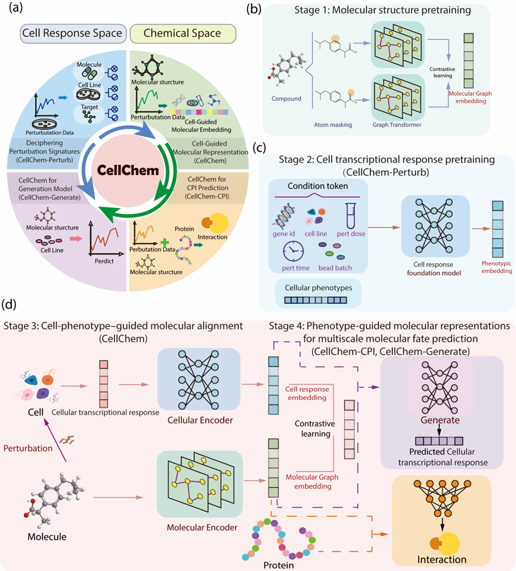

# CellChem

## Overview

CellChem is a cross-modal chemical-omics pre-training model that integrates chemical structural information with transcriptomic perturbation profiles. Designed to synergize the biological breadth of phenotypic screening with the molecular precision of structure-based screening, CellChem unifies three critical drug design tasks within a coherent framework spanning chemical and omics domains:

1. **Bidirectional mapping** between chemical and phenotypic spaces
2. **Transcriptome-based compound-protein interaction (CPI) prediction**
3. **Chemical structure-based generation** of transcriptomic perturbation profiles



## Environment Setup

Create and configure the Python environment for CellChem:

```bash
# source /appsource/gcc-13.2.0.sh  # If needed for your system
source /path/to/cuda-12.1.sh  # Update path to your CUDA installation

# Create Conda environment
conda create -n CellChem python=3.11
conda activate CellChem

# Install PyTorch 2.3.1 with CUDA 12.1 support
# NOTE: We pin mkl<2025.0.0 to resolve symbol conflicts with PyTorch 2.3.1
conda install pytorch==2.3.1 torchvision==0.18.1 torchaudio==2.3.1 pytorch-cuda=12.1 "mkl<2025.0.0" "numpy<2" -c pytorch -c nvidia -y

# Install PyTorch Geometric (PyG) and dependencies
pip install torch_geometric
pip install pyg_lib torch_scatter torch_sparse torch_cluster torch_spline_conv -f https://data.pyg.org/whl/torch-2.3.1+cu121.html

# Install core scientific computing packages
pip install PyYAML anndata scanpy hdf5plugin
pip install torchtext==0.18.0
pip install transformers

# Install additional dependencies
pip install scib datasets cmapPy wandb tensorboard
conda install cudnn pandas
pip install ninja packaging

# Set compiler flags and install specialized packages
export CFLAGS="-lm"
pip install flash-attn==1.0.4 --no-build-isolation  # Requires GCC 9 or later
pip install 'rdkit<2024' easydict IPython
pip install scikit-learn
pip install fair-esm
```

## 📦 Data Download

**Note:** Some models and datasets are large. Please download the data from the following link before running the code:

- **Baidu Netdisk:** [https://pan.baidu.com/s/1CbyfT47ysgJwnmbLd2LRJQ?pwd=chem](https://pan.baidu.com/s/1CbyfT47ysgJwnmbLd2LRJQ?pwd=chem)
- **Extraction Code:** `chem`

## Quick Start

### 1. Chemical-Omics Pre-training Model

This module is located in the `CellChem_pretrain` folder.
Place downloaded `source/data` folder into `CellChem_pretrain/`

#### Training Stages

1. **Molecular Pre-training:** `CellChem_pretrain/mol_gt_pretrain/train.py`
2. **Perturbation Profile Pre-training:** `CellChem_pretrain/perturb_pretrain/pretrain_perturb.py`
3. **Chemical-Omics Multi-modal Pre-training:** `CellChem_pretrain/CellChem/examples/mutimodel.py`

#### Data/Model Setup

Due to the large size of data and model files, please place them as follows:

```text
CellChem_pretrain/
├── data/ (from source/data/)
├── CellChem/save/
│ └── dev_clue-May20-00-03/ (from source/dev_clue-May20-00-03/)
├── mol_gt_pretrain/ckpt/
│ └── May08_16-21-26/ (from source/May08_16-21-26/)
└── perturb_pretrain/save/
└── dev_clue-May20-00-03/ (from source/dev_clue-May20-00-03/)
```

**Output:** Results will be saved as `CellChem_pretrain/data/output_adata.h5ad`.

### 2. Transcriptome-Guided Compound-Protein Interaction (CPI) Model

This module is located in the `CPI` folder. For detailed model architecture, please refer to Figure S6 in the appendix of our paper.

#### Setup

- Place downloaded `source/CPI/data` folder into `CPI/perturb_and_sequence/`

#### Model Variants

- **CellChem**: Uses encodings derived from the large chemical-omics model
- **CellChem_wo**: Uses only the molecular graph model

#### Training

Run the training script:

```bash
CPI/perturb_and_sequence/run_CellChem.py
CPI/perturb_and_sequence/run_CellChem_wo.py
```

#### Inference with Pre-trained Models

To use pre-trained models for inference directly:

##### Model Placement

1. Place downloaded model folders:
   - `source/Model_CellChem_random_save` → `CPI/perturb_and_sequence/`
   - `source/Model_CellChem_scaffold_save` → `CPI/perturb_and_sequence/`
   - `source/Model_save` → `CPI/perturb_only/`

##### Running Inference

Run the appropriate test script:

- `test.py` (for CellChem)

---

### 🧬 Generation Model: Molecular Graph to Perturbation Profiles

This module is located in the `CellChem_generate` folder.

#### Setup

- Place downloaded data `source/data_generate` into the `CellChem_generate` directory

#### Training for Different Data Splits

Run the appropriate training script based on different data split scenario:

| Split Type | Script Path |
|------------|-------------|
| Random Split | `python CellChem_generate/generate_train.py --scenario random` |
| Scaffold Split | `python CellChem_generate/generate_train.py --scenario scaffold` |
| Cell Type Split | `python CellChem_generate/generate_train.py --scenario celltype` |

#### Pre-trained Models

Download and place the following pre-trained models:

| Split Type | Source Path | Destination Path |
|------------|-------------|------------------|
| Random Split | `source/save/dev_clue-Jan09-13-48` | `CellChem_generate/save/dev_clue-Jan09-13-48` |
| Scaffold Split | `source/save/dev_clue-Jan12-00-34` | `CellChem_generate/save/dev_clue-Jan12-00-34` |
| Cell Type Split | `source/save/dev_clue-Jan14-04-51` | `CellChem_generate/save/dev_clue-Jan14-04-51` |

**Output:** Predicted transcriptome data for traditional Chinese medicine (TCM) compounds is saved in `CellChem_generate/data_generate/herb_output_new_category.h5ad`.

---

## 🤝 Contact

If you encounter any path errors or code issues, please contact us at **<chenjxjx@pku.edu.cn>**. We appreciate your feedback!

## 📄 Citation

If you use CellChem in your research, please cite our paper:

```bibtex
[Please add your citation here]
